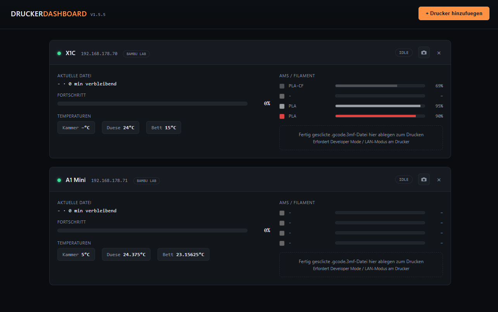

# Bambu Lab + Formlabs Drucker Dashboard



Lokales Web-Dashboard fuer Bambu Lab (MQTT) und Formlabs (HTTP) 3D-Drucker.
Fortschritt, aktuelle Datei, Kamera (Bambu), AMS-Filamente (Bambu),
Kammertemperatur (Bambu) und geladenes Material (Formlabs) in einem
dunklen Dashboard im Browser.

## 0. Automatischer Build per GitHub Actions (keine lokale Installation noetig)

Dieses Repository enthaelt bereits eine fertige Workflow-Datei unter
`.github/workflows/build-exe.yml`. Sie baut bei jedem Push automatisch
**zwei Zip-Pakete**:

- `DruckerDashboard-v<Version>-windows.zip`
- `DruckerDashboard-v<Version>-macos-arm64.zip` — gebaut auf einem
  `macos-14`-GitHub-Runner, das ist bereits eine native Apple-Silicon-
  Maschine, es wird also nicht cross-kompiliert.

**Jedes Zip enthaelt ZWEI Dateien**, die zusammen im selben Ordner
bleiben muessen:
- `DruckerDashboard.exe` (bzw. `DruckerDashboard` auf macOS) — das
  Hauptprogramm
- `FtpsUploadHelper.exe` (bzw. `FtpsUploadHelper` auf macOS) — ein
  kleines Hilfsprogramm ausschliesslich fuer den Datei-Upload zu Bambu-
  Lab-Druckern (siehe Abschnitt 4a fuer die Begruendung, warum das ein
  separates Programm ist statt in `DruckerDashboard` eingebaut)

Es muss nichts weiter erzeugt werden — nur das Repository auf GitHub
hochladen:

1. Neues (leeres) Repository auf GitHub anlegen.
2. Den kompletten Inhalt dieses Ordners (inkl. dem versteckten Ordner
   `.github/`) in das Repository pushen:
   ```bash
   git init
   git add .
   git commit -m "Initial commit"
   git branch -M main
   git remote add origin https://github.com/<dein-user>/<dein-repo>.git
   git push -u origin main
   ```
3. Im GitHub-Repository auf den Tab **Actions** wechseln — der Workflow
   "Build" startet automatisch nach dem Push.
4. Nach ca. 2-4 Minuten (gruener Haken) auf den abgeschlossenen Workflow-Lauf
   klicken → unter **Artifacts** liegen beide Zip-Pakete
   (`DruckerDashboard-v<Version>-windows` und
   `DruckerDashboard-v<Version>-macos-arm64`) zum Herunterladen bereit.
5. Zip entpacken — **beide enthaltenen Dateien muessen im selben Ordner
   bleiben** — dann `DruckerDashboard.exe` starten.

**Alternative: automatischer GitHub Release mit Download-Link**
Wird zusaetzlich ein Git-Tag im Format `vX.Y.Z` gepusht (die Version sollte
mit `APP_VERSION` in `app.py` uebereinstimmen, siehe Abschnitt "Versionierung"
weiter unten), legt der Workflow automatisch einen GitHub Release mit
**beiden** Zip-Paketen als Download an:
```bash
git tag v1.5.5
git push origin v1.5.5
```

Der Workflow braucht keine weiteren Geheimnisse/Secrets — `GITHUB_TOKEN`
wird von GitHub Actions automatisch bereitgestellt.

**Hinweis macOS/Gatekeeper:** Die macOS-Binaries sind nicht signiert/
notarisiert (dafuer waere eine kostenpflichtige Apple-Developer-ID
noetig). Beim ersten Start blockiert macOS die Datei standardmaessig.
Abhilfe: nach dem Entpacken im Finder Rechtsklick auf `DruckerDashboard`
→ "Oeffnen" → "Trotzdem oeffnen" bestaetigen (nur beim allerersten
Start noetig, ggf. fuer beide Dateien einzeln), oder im Terminal:
```bash
xattr -dr com.apple.quarantine DruckerDashboard
xattr -dr com.apple.quarantine FtpsUploadHelper

```

## 0a. Versionierung

`app.py` enthaelt ganz oben die Konstante `APP_VERSION` (semantische
Versionierung, `MAJOR.MINOR.PATCH`) — das ist die einzige Quelle der
Wahrheit fuer die Versionsnummer. Der GitHub-Actions-Workflow liest sie
automatisch aus und nutzt sie fuer Datei-/Artifact-Namen. Im Dashboard
selbst wird sie oben rechts neben dem Titel angezeigt (`GET /api/version`).

Regeln fuer die naechste Version (bei jeder ausgelieferten Aenderung
anwenden):
- **PATCH** (z. B. 1.1.0 → 1.1.1): Bugfix, keine neuen Features.
- **MINOR** (z. B. 1.1.0 → 1.2.0): neues Feature, additiv, nichts
  Bestehendes bricht (z. B. neuer Druckertyp, neue Karten-Funktion).
- **MAJOR** (z. B. 1.1.0 → 2.0.0): Breaking Change (z. B. `config.json`-
  Format nicht mehr abwaertskompatibel).

Beim Taggen und Veroeffentlichen: `APP_VERSION` in `app.py` zuerst
anpassen, committen, dann erst den passenden Git-Tag setzen (siehe
Abschnitt 0) — Tag und `APP_VERSION` sollten immer uebereinstimmen.

## 1. Benoetigte Python-Pakete

| Paket        | Zweck                                                        |
|--------------|---------------------------------------------------------------|
| `flask`      | Web-Server / stellt das Dashboard im Browser bereit          |
| `paho-mqtt`  | MQTT-Client fuer die Verbindung zu den Bambu Lab Druckern     |
| `pyinstaller`| Wandelt das Python-Skript in eine eigenstaendige `.exe` um    |

Installation (in einer Kommandozeile im Projektordner):

```bash
python -m venv venv
venv\Scripts\activate        # unter Windows
pip install -r requirements.txt
```

oder einzeln:

```bash
pip install flask==3.0.3 paho-mqtt==1.6.1 pyinstaller==6.10.0
```

> Wichtig: `paho-mqtt` bewusst auf Version 1.6.1 gepinnt, da Version 2.x
> eine andere Callback-Signatur verwendet. Der Code in `app.py` ist auf die
> 1.x-API abgestimmt.

## 2. Programm testen (ohne exe)

```bash
python app.py
```

Danach ist das Dashboard erreichbar unter:

```
http://<IP-des-PCs>:8000
```

Die IP des PCs findet man z. B. mit `ipconfig` (Windows) unter "IPv4-Adresse".

## 3. Umwandlung in eine .exe mit PyInstaller (lokal, optional)

> Wer den Build lieber per GitHub Actions laufen lassen will, kann diesen
> Abschnitt ueberspringen — siehe Abschnitt 0 oben. Der folgende Weg ist
> nur fuer den Fall gedacht, dass die exe lokal auf einem eigenen Windows-
> Rechner gebaut werden soll.

Im Projektordner (dort wo `app.py` liegt) ausfuehren:

```bash
pyinstaller --onefile --name DruckerDashboard --console app.py
pyinstaller --onefile --name FtpsUploadHelper --console ftps_upload_helper.py
```

Ergebnis: `dist/DruckerDashboard.exe` und `dist/FtpsUploadHelper.exe`
— **beide Dateien werden zum Weitergeben benoetigt** (siehe Abschnitt
4a, warum der Datei-Upload zu Bambu-Druckern ueber eine separate exe
laeuft).

- `--onefile` erzeugt eine einzelne, portable exe-Datei.
- `--console` laesst ein Konsolenfenster offen (zeigt die Log-Ausgabe /
  die URL des Dashboards). Wer bei `DruckerDashboard.exe` kein
  Konsolenfenster moechte, kann dort `--windowed` statt `--console`
  verwenden — dann laeuft das Programm unsichtbar im Hintergrund.
  `FtpsUploadHelper.exe` sollte bei `--console` bleiben (unschaedlich,
  das Fenster erscheint ohnehin nicht sichtbar laenger als den Bruchteil
  einer Sekunde, da es nur intern vom Hauptprogramm aufgerufen wird).
- Es werden keine `--add-data` Parameter benoetigt, da das komplette
  HTML/CSS/JS des Dashboards direkt im Python-Code eingebettet ist.

**Wichtig:** Die Datei `config.json` wird von `DruckerDashboard.exe` beim
ersten Start automatisch im selben Ordner wie die exe angelegt, falls sie
noch nicht existiert. Sie kann danach mit einem Texteditor angepasst werden
(z. B. um Drucker manuell einzutragen, statt sie ueber den Button
"Drucker hinzufuegen" im Browser anzulegen).

Ordnerstruktur nach dem Build, so wie sie weitergegeben werden sollte:

```
DruckerDashboard.exe
FtpsUploadHelper.exe (WICHTIG: im selben Ordner wie DruckerDashboard.exe!)
config.json          (wird beim ersten Start automatisch erzeugt)
```

**Lokal auf einem Mac bauen (statt ueber GitHub Actions):** Der gleiche
Befehl funktioniert unveraendert auf macOS (nativ auf Apple Silicon
ausfuehren, kein Rosetta noetig):
```bash
pyinstaller --onefile --name DruckerDashboard --console app.py
pyinstaller --onefile --name FtpsUploadHelper --console ftps_upload_helper.py
```
Ergebnis: `dist/DruckerDashboard` und `dist/FtpsUploadHelper` (ohne
Dateiendung, beide im selben Ordner weitergeben). Siehe Abschnitt 0
fuer den Gatekeeper-Hinweis, falls die Dateien beim ersten Start
blockiert werden.

## 3a. Formlabs-Geraete hinzufuegen (Drucker, Wash L, Cure L)

Im Formular "Drucker hinzufuegen" beim Feld "Druckertyp" **Formlabs
(Drucker)**, **Formlabs Wash L** oder **Formlabs Cure L** auswaehlen. Es
werden dann nur **Name** und **IP-Adresse** abgefragt.

Angezeigt werden:

- Formlabs-Drucker: Fortschritt (Balken + Zahl), aktueller Druckauftrag,
  geladenes Harz/Material
- Wash L: Fortschritt, aktueller Waschzyklus
- Cure L: Fortschritt, aktueller Haertezyklus

**WICHTIGE Voraussetzung — bitte unbedingt lesen:** Formlabs veroeffentlicht
— anders als Bambu Lab — keine Status-API, die direkt unter der IP des
Geraets erreichbar ist. Der einzige von Formlabs offiziell dokumentierte
Weg, lokal per IP an Geraetestatus zu kommen, ist die **"Formlabs Local
API"**: dafuer muss zusaetzlich auf einem PC im selben Netzwerk (z. B. dem
PC, auf dem auch dieses Dashboard laeuft) das kostenlose Programm
**PreFormServer** (Teil der normalen PreForm-Installation) im Hintergrund
laufen:

```bash
PreFormServer.exe --port 44388
```

Dieses Dashboard verbindet sich dann zu `http://localhost:44388`
(konfigurierbar über `preform_server` in `config.json`, falls
PreFormServer auf einem anderen PC im Netz laeuft). **Laeuft kein
PreFormServer, bleibt die Karte ohne Daten** — das Dashboard zeigt dann
einen roten Hinweistext direkt auf der Karte an (z. B. "PreFormServer
nicht erreichbar"), damit klar ist, woran es liegt.

Die **Original-Geraete "Form Wash" und "Form Cure" (ohne "L")** haben laut
Formlabs **keinerlei Netzwerkfunktion** und koennen technisch nicht
eingebunden werden — nur die "L"-Varianten (Form Wash L / Form Cure L, mit
Ethernet/WLAN) sind ueberhaupt fähig, im Netzwerk erkannt zu werden.

Das genaue JSON-Format der Geraeteantwort kann je nach Geraetetyp/Firmware
variieren. `FormlabsLocalApiConnection` in `app.py` durchsucht die Antwort
daher defensiv nach den gaengigsten Feldnamen fuer Fortschritt/Auftrag/
Material. Werden Werte nicht angezeigt, kann man die Konstanten
`FL_PROGRESS_KEYS`, `FL_FILE_KEYS`, `FL_MATERIAL_KEYS`, `FL_STATE_KEYS` am
Anfang dieses Abschnitts in `app.py` um die tatsaechlichen Feldnamen
ergaenzen (z. B. per `curl http://localhost:44388/devices/` herausfinden).

## 3b. OctoPrint-Drucker hinzufuegen

Im Formular "Drucker hinzufuegen" den Typ **OctoPrint** waehlen. Benoetigt:

- **IP-Adresse** des Raspberry Pi / Rechners, auf dem OctoPrint laeuft
- **API-Key**: OctoPrint → Einstellungen (Zahnrad) → API → "API Key"
- Optional: Port (Standard 80), HTTPS-Haekchen, eigene Webcam-URL

OctoPrint-Drucker werden **genauso dargestellt wie Bambu Lab Drucker**:
Fortschritt als Balken + Zahl, aktuelle Datei, Duesen-/Betttemperatur und
ein Kamera-Icon. Das Kamera-Icon verlinkt direkt auf den MJPEG-Stream, den
OctoPrint/mjpg-streamer selbst bereitstellt (Standard-Vermutung:
`http://<IP>:8080/webcam/?action=stream` — falls abweichend, beim
Hinzufuegen die "Webcam-URL" manuell angeben).

Hinweis: OctoPrint liefert i. d. R. keine Kammertemperatur und kein
AMS-Aequivalent, diese Felder bleiben daher leer — das ist normal.

## 3d. Creality-Drucker hinzufuegen (K1 / K1C / K1 Max / K1 SE / sonstige Klipper-Modelle)

Im Formular "Drucker hinzufuegen" beim Feld "Druckertyp" die passende
Creality-Version auswaehlen:

- **Creality K1**
- **Creality K1C**
- **Creality K1 Max**
- **Creality K1 SE**
- **Creality (sonstiger Klipper-Drucker)** — z. B. ein Ender/CR-Drucker mit
  Klipper-Umbau (etwa per Sonic Pad)

Diese fuenf Optionen dienen **nur der Beschriftung** auf der Karte — die
technische Anbindung ist bei allen identisch, da sie alle auf derselben,
offiziell dokumentierten **Moonraker-API** basiert (dem Web-API-Server
hinter den bekannten Oberflaechen Fluidd/Mainsail).

**WICHTIGE Voraussetzung — bitte unbedingt lesen:** Auf den werkseitig
ausgelieferten K1/K1C/K1 Max/K1 SE ist Moonraker **nicht vorinstalliert**.
Damit dieses Dashboard sich verbinden kann, muss der Drucker zunaechst per
SSH "gerootet" und Moonraker manuell nachinstalliert werden. Das ist unter
Creality-K1-Besitzern weit verbreitet und gut dokumentiert, z. B. ueber das
**Creality-Helper-Script**:
`https://github.com/Guilouz/Creality-Helper-Script-Wiki`

Bei einem Ender/CR-Drucker mit Klipper-Umbau (Sonic Pad o. ae.) ist
Moonraker je nach Setup meist ohnehin schon vorhanden.

Benoetigte Angaben beim Hinzufuegen:

- **IP-Adresse** des Druckers
- **Moonraker-Port** (Standard: `7125`)
- **API-Key** — bei den meisten Standard-Setups **nicht noetig**, da
  Moonraker LAN-IPs ueblicherweise ueber `trusted_clients` in
  `moonraker.conf` automatisch vertraut. Nur falls Moonraker mit
  Authentifizierung konfiguriert ist, hier den Key eintragen (zu finden
  z. B. in Fluidd/Mainsail unter Einstellungen).
- Optional: eigene **Webcam-URL**, falls der Standard-Pfad von Crowsnest
  (`http://<IP>/webcam/?action=stream`) nicht passt.

Angezeigt werden: Fortschritt (Balken + Zahl), aktuelle Datei, Duesen- und
Betttemperatur sowie — falls im Klipper-Setup ein passender Sensor
konfiguriert ist (z. B. beim K1 Max) — die Kammertemperatur. Kein
AMS-Aequivalent (Klipper/Moonraker kennt dieses Konzept in der
Standard-API nicht).

**Bewusst NICHT unterstuetzt:** neuere Creality-Modelle mit reinem
"Creality OS" ohne Klipper (z. B. Ender-3 V3 SE). Dafuer ist keine
offiziell dokumentierte lokale Status-API bekannt — eine Anbindung waere
reines Raten ins Blaue, genau das Problem, das beim ersten
(fehlgeschlagenen) Formlabs-Versuch bereits aufgetreten ist. Sollte
Creality fuer diese Modelle zukuenftig eine lokale API veroeffentlichen,
kann `CrealityConnection` in `app.py` entsprechend erweitert werden.

## 3f. Ultimaker-Drucker hinzufuegen (UM3, S-Serie, Factor 4)

Im Formular "Drucker hinzufuegen" den Typ **Ultimaker** waehlen. Benoetigt
wird nur **Name** und **IP-Adresse** — Ultimaker-Drucker mit
Netzwerkanschluss (UM3, S3, S5, S7, Factor 4) bieten eine offizielle,
direkt auf dem Drucker laufende lokale REST-API unter
`http://<Drucker-IP>/api/v1/` (Swagger-Dokumentation dazu direkt am
Drucker unter `http://<Drucker-IP>/docs/api/`). Fuer reine Status-
Abfragen — alles, was dieses Dashboard macht — ist **kein Login/API-Key**
noetig, das wird laut Ultimaker-Dokumentation nur fuer schreibende
Aktionen (z. B. Druckauftrag starten) benoetigt.

Angezeigt werden: Fortschritt (Balken + Zahl), aktuelle Datei inkl.
verbleibender Restzeit, Duesen- und Betttemperatur. Ein Kamera-Icon
verlinkt auf den eingebauten Kamerastream (Standard-Pfad
`http://<IP>:8080/?action=stream`, bei Bedarf per "Webcam-URL" beim
Hinzufuegen ueberschreibbar).

Hinweis: Ultimaker-Desktopdrucker haben keinen Kammertemperatursensor,
dieses Feld bleibt daher immer leer — das ist normal.

## 3g. Eigene Sensoren & Schaltflaechen per zweitem MQTT-Broker

Ueber einen **zweiten, von den Druckern unabhaengigen MQTT-Broker** (z. B.
den eigenen Home-Assistant/Mosquitto-Broker) lassen sich beliebige Sensoren
und Ein/Aus-Schaltflaechen an einer Drucker-Karte anzeigen — z. B. eine
Steckdosen-Leistungsanzeige oder ein Lichtschalter fuer die Werkstatt.

Aktuell wird das ueber `config.json` konfiguriert (kein eigenes Formular
in der Weboberflaeche). Zwei Teile:

**1. Broker global aktivieren** (einmal pro `config.json`):
```json
"extras_mqtt": {
    "enabled": true,
    "host": "192.168.1.5",
    "port": 1883,
    "username": "",
    "password": "",
    "tls": false
}
```

**2. Sensoren/Schalter je Drucker in dessen `"extras"`-Liste eintragen:**
```json
"extras": [
    {
        "id": "steckdose1",
        "label": "Steckdose (Watt)",
        "kind": "sensor",
        "topic": "home/printer1/power",
        "unit": "W"
    },
    {
        "id": "licht1",
        "label": "Werkstattlicht",
        "kind": "switch",
        "command_topic": "home/printer1/light/set",
        "payload_on": "ON",
        "payload_off": "OFF"
    }
]
```

- `kind: "sensor"` abonniert `topic` und zeigt den zuletzt empfangenen Wert
  (+ optional `unit`) an.
- `kind: "switch"` zeigt zwei Buttons ("Ein"/"Aus"), die beim Klick den
  jeweiligen `payload_on`/`payload_off` auf `command_topic` senden — ohne
  Rueckmeldung vom Broker (einfache Fire-and-forget-Schaltflaeche).
- `id` muss innerhalb der `extras`-Liste eines Druckers eindeutig sein.

Nach dem Speichern von `config.json` das Dashboard neu starten (bzw. die
exe neu starten), damit die Aenderung geladen wird.

## 4. Voraussetzungen auf Seite der Bambu Lab Drucker

Damit die Verbindung funktioniert, muss an jedem Bambu Lab Drucker der
**LAN-Modus / "Nur lokaler Zugriff" (Developer Mode)** aktiviert sein:

1. Am Drucker-Display: Einstellungen → WLAN → "LAN-Modus" aktivieren.
2. Dort wird ein 8-stelliger **Access Code** angezeigt — dieser wird beim
   Hinzufuegen des Druckers im Dashboard benoetigt.
3. Die **Seriennummer** des Druckers steht auf dem Typenschild oder unter
   Einstellungen → Geraeteinformationen.
4. Die **IP-Adresse** des Druckers findet man ebenfalls im WLAN-Menue des
   Druckers (oder im Router).

Ohne Name und IP allein kann keine Verbindung aufgebaut werden — Bambu Lab
Drucker verlangen zusaetzlich den Access Code (Passwort fuer MQTT) und die
Seriennummer (fuer das MQTT-Topic). Das Formular "Drucker hinzufuegen" im
Dashboard fragt daher vier Felder ab: **Name, IP-Adresse, Access Code,
Seriennummer**.

**Zusaetzlich fuer die Druckfunktion (Abschnitt 4a) noetig:** Der
**"Developer Mode"** muss zusaetzlich zum LAN-Modus separat aktiviert
werden (Bambu Handy App → Drucker auswaehlen → Einstellungen →
"Developer Mode"). Ohne Developer Mode lehnt die Firmware neuerer
Drucker das Starten eines Druckauftrags per MQTT ab (reine Status-
Anzeige funktioniert davon unabhaengig auch ohne Developer Mode).

## 4a. Bambu Lab: Druckauftrag per Drag & Drop senden

Jede Bambu-Lab-Karte hat unterhalb der AMS-Anzeige ein Ablage-Feld. Zieht
man eine Datei dorthin, passiert das in zwei Schritten:

1. **Vorschau/Zuordnung pruefen:** Die Datei wird zum Dashboard
   hochgeladen (noch NICHT zum Drucker!) und ausgelesen. Ein Dialog
   ("AMS-Zuordnung pruefen") oeffnet sich und zeigt **ausschliesslich die
   fuer diesen Druck tatsaechlich benoetigten Filamente** (nicht alle im
   Projekt konfigurierten Filamente — ein Projekt kann mehr Filamente
   definiert haben, als auf der gedruckten Platte verwendet werden; siehe
   technischer Hinweis unten). Pro benoetigtem Filament gibt es zwei
   Optionen zur Auswahl:
   - **"Vorschlag aus Datei verwenden"** (voreingestellt): das laut
     Datei vorgesehene Material, automatisch auf ein aktuell im AMS
     liegendes Fach mit exakt passender Farbe gemappt, sofern eines
     gefunden wurde — sonst "Extern / manuell am Display". Die Farbe
     wird dabei zusaetzlich zum Farbfeld auch **als deutsches Farbwort**
     angezeigt (z. B. "PLA · Rot" statt eines Hex-Codes wie "#FF0000") —
     der genaue Hex-Wert bleibt bei Bedarf als Tooltip beim Ueberfahren
     mit der Maus abrufbar. Die Zuordnung Hex → Wort ist eine Näherung
     (naechstliegende Farbe aus einer festen Liste gaengiger Farbnamen),
     keine exakte Farbverwaltung — bei sehr changierenden/gemischten
     Filamentfarben kann das Wort nur ungefaehr passen.
   - **"Anderes Material aus dem AMS waehlen"**: Dropdown mit allen
     *anderen* aktuell im AMS erkannten Faechern (ebenfalls mit
     Farbwort statt Hex-Code in der Liste), um bewusst ein abweichendes
     Material einzusetzen (z. B. weil die Originalfarbe gerade nicht
     bestueckt ist).
2. **Bestaetigen:** Ein Klick auf "Drucken starten" laedt die Datei per
   FTPS auf den Drucker
   und startet den Druck mit genau der im Dialog gewaehlten Zuordnung.
   Waehrend des Uploads zeigt ein **Fortschrittsbalken mit
   Prozentangabe** (inkl. übertragener/gesamter Dateigroesse) den Stand
   — die Anfrage laeuft im Hintergrund, der Browser fragt den
   Fortschritt laufend ab. "Abbrechen" verwirft den Vorgang, ohne dass
   irgendetwas an den Drucker gesendet wird. **Schlaegt der Upload fehl,
   bleiben Datei und Zuordnung erhalten** — ein erneuter Klick auf
   "Drucken starten" versucht es direkt noch einmal, ohne die Datei neu
   hochladen oder die AMS-Zuordnung neu waehlen zu muessen.

Das Ergebnis (Erfolg/Fehler, wie viele Filamente zugeordnet wurden)
erscheint als kurze Einblendung oben rechts (Toast) — unabhaengig vom
Karten-Grid, das sich alle 2,5 Sekunden aktualisiert.

- **Unterstuetzt werden ausschliesslich fertig gesclicte `.gcode.3mf`-
  Dateien**, wie sie Bambu Studio/OrcaSlicer beim Slicen erzeugen — keine
  rohen `.gcode`- oder `.3mf`-Projektdateien ohne Slicing, und keine STL/
  Step-Dateien. Der Grund: Bambu-Drucker lassen sich laut mehreren
  unabhaengigen Community-Quellen nur ueber bereits auf dem Drucker
  liegende, fertig gesclicte `.gcode.3mf`-Dateien per MQTT starten.
- Technisch laeuft das in zwei Schritten ab: Upload per **FTPS (Port
  990, implizites TLS)** über Pythons eingebautes `ftplib`/`ssl`
  (`bblp` + Access Code als Login), danach ein **MQTT-Kommando
  `project_file`** über die ohnehin bestehende Status-Verbindung.
  Siehe Abschnitt "X1-Serie (X1C, X1E): bekanntes Problem behoben"
  weiter unten fuer Hintergrund zu einem inzwischen behobenen Sonderfall.
- **Developer Mode muss aktiviert sein** (siehe Abschnitt 4) — sonst
  meldet der Dialog beim Bestaetigen einen Fehler vom Drucker.
- **Nur benoetigte Filamente:** `Metadata/project_settings.config` in
  der `.gcode.3mf` listet ALLE im Slicer-Projekt konfigurierten
  Filamente; welche davon auf der konkret gedruckten Platte (Plate 1 -
  das Dashboard druckt immer `Metadata/plate_1.gcode`) tatsaechlich
  verbraucht werden, steht separat in `Metadata/slice_info.config`. Nur
  diese Schnittmenge wird im Dialog angezeigt. Ist `slice_info.config`
  nicht vorhanden oder nicht auswertbar, zeigt das Dashboard sicherheits-
  halber alle konfigurierten Filamente (kein Risiko, nur weniger
  praezise).
- **AMS-Zuordnungsvorschlag:** Farbe + Materialtyp jedes benoetigten
  Filaments werden mit den *aktuell* vom Drucker gemeldeten AMS-Faechern
  abgeglichen (exakte Farbe + passender Typ). Kann ein Filament nicht
  eindeutig zugeordnet werden (keine passende Farbe im AMS, kein AMS
  erkannt, Datei ohne auswertbare Filament-Infos), wird **nicht
  geraten** — die Vorauswahl steht dann auf "Extern / manuell am
  Display".
  **Wichtig bei Verbundwerkstoffen (seit v1.5.5 korrekt):** Materialien
  mit Verstaerkungs-Suffix (z. B. `PLA-CF`, `PETG-CF`, `ASA-CF`, `ABS-GF`)
  werden **nie** mit ihrer unverstaerkten Grundvariante (z. B. `PLA`,
  `ASA`) verwechselt, selbst bei identischer Fach-Farbe — diese
  Materialien haben unterschiedliche Druckeigenschaften und sollten
  niemals automatisch gegeneinander ausgetauscht werden. Vorherige
  Versionen hatten hier eine zu lockere Teilstring-Pruefung, die z. B.
  ein Fach mit reinem ASA faelschlich als passend fuer ein ASA-CF-
  Filament vorgeschlagen haben konnte, wenn die Farbe zufaellig
  uebereinstimmte — das konnte dazu fuehren, dass der Drucker beim
  Materialladen auf eine RFID-Abweichung stoesst und auf eine
  Bestaetigung am Display wartet (was ohne jemanden vor Ort wie ein
  Haengenbleiben wirkt).
  Hinweis: In seltenen Faellen ist die Filament-ID in der `.3mf`-Datei
  selbst leer (ein bekanntes Slicer-Verhalten) — dann ignoriert die
  Druckerfirmware jede AMS-Zuordnung unabhaengig davon, was gesendet
  wird; das ist keine Einschraenkung dieses Programms.
- Diese Funktion ist aktuell **nur fuer den Typ `bambu` verfuegbar**,
  nicht fuer OctoPrint/Creality/Formlabs/Ultimaker (die haben eigene,
  etablierte Wege fuer Druckauftraege, z. B. OctoPrint-Weboberflaeche
  oder Moonraker/Fluidd/Mainsail).
- **X1-Serie (X1C, X1E): bekanntes Problem behoben (seit v1.5.4).**
  Auf diesen Modellen brach der Datei-Upload zuvor reproduzierbar mit
  `EOF occurred in violation of protocol` ab, waehrend dieselbe Funktion
  auf einem A1 Mini funktionierte. **Tatsaechliche Ursache:** Die
  X1-Serie laeuft intern auf **vsftpd** mit aktivierter Option
  `require_ssl_reuse` — die Datenverbindung (fuer den eigentlichen
  Datei-Upload) muss dieselbe TLS-Sitzung wie die Kontrollverbindung
  fortsetzen (ein Schutz gegen Session-Hijacking). Pythons eingebautes
  `ftplib`-Modul stellt diese Sitzungs-Wiederverwendung fuer die
  Datenverbindung **nicht automatisch her** (eine fruehere Annahme des
  Gegenteils war schlicht falsch — durch direkte Pruefung des Python-
  Quellcodes widerlegt). Ohne das explizite Nachruesten dieser Sitzungs-
  Wiederverwendung lehnt die X1-Firmware die Datenverbindung nach
  einigen zehntausend Bytes ab. Das erklaert auch, warum FileZilla immer
  funktionierte (es macht das automatisch richtig) und warum die
  A1-Serie nicht betroffen war (leichterer FTPS-Server ohne diese
  strikte vsftpd-Pruefung). Bestaetigt durch einen direkten Vergleichs-
  test: ein eigenstaendiges Diagnose-Tool mit expliziter Sitzungs-
  Wiederverwendung uebertrug zuverlaessig, waehrend dieselbe Logik ohne
  dieses eine Detail reproduzierbar bei ca. 11% abbrach — selbst als
  komplett eigenstaendiges, unabhaengig gestartetes Programm (siehe
  UEBERGABE.md fuer die volle Chronologie inkl. dreier zwischenzeitlicher
  Fehldiagnosen, die sich alle als nicht ursaechlich herausstellten).
  **Fix (v1.5.4):** `ImplicitFtpTls` in `app.py` und
  `ftps_upload_helper.py` uebergibt beim Aufbau der Datenverbindung
  jetzt explizit `session=self.sock.session`, um die TLS-Sitzung der
  Kontrollverbindung korrekt wiederzuverwenden.
  **Die separate Hilfsanwendung `FtpsUploadHelper.exe`** (seit v1.5.3,
  siehe Abschnitt 0/3) bleibt bestehen — sie war zwar nicht die
  Ursache dieses Problems, ist aber weiterhin sinnvoll (siehe
  UEBERGABE.md fuer Details).
  **Betroffen war ausschliesslich der Drag & Drop-Datei-Upload** —
  Status, Kamera und AMS-Anzeige liefen auf der X1-Serie schon vorher
  einwandfrei, da diese ueber MQTT laufen, nicht ueber FTPS.

## 5. Funktionsumfang

- Beliebig viele Drucker/Geraete per Formular hinzufuegen / entfernen —
  Bambu Lab, Formlabs (Drucker/Wash L/Cure L), OctoPrint, Creality
  (K1/K1C/K1 Max/K1 SE/sonstiger Klipper-Drucker) oder Ultimaker
- Drucker werden untereinander als Karten dargestellt
- Fortschritt als Balken + Prozentzahl (alle Geraetetypen)
- Name der aktuellen Datei/des aktuellen Auftrags (alle Geraetetypen,
  mit auf den Geraetetyp abgestimmter Bezeichnung, z. B. "Aktueller
  Waschzyklus" bei Wash L statt "Aktuelle Datei")
- **Bambu Lab, OctoPrint, Creality & Ultimaker:** Kamera-Icon oeffnet das
  Live-Kamerabild
- **Bambu Lab:** AMS-Fuellstand je Fach als farbiges Balkendiagramm (Farbe =
  Filamentfarbe), inkl. Filament-Sorte (PLA, PETG, ABS, ...)
- **Bambu Lab, OctoPrint, Creality & Ultimaker:** Duesen- und Betttemperatur;
  **Bambu Lab** zusaetzlich immer, **Creality** falls im Klipper-Setup
  konfiguriert, die Kammertemperatur (P1-Modelle ohne Gehaeuse-Kit liefern
  hier ggf. keinen sinnvollen Wert — Hardware-Grenze, kein Software-Fehler;
  bei **Ultimaker** ist keine Kammertemperatur verfuegbar, da die
  Desktopmodelle keinen entsprechenden Sensor besitzen)
- **Formlabs:** Anzeige des aktuell geladenen Harzes/Materials
- **Bambu Lab, OctoPrint & Ultimaker:** verbleibende Restdruckzeit in
  Stunden/Minuten neben dem Dateinamen
- Bei Verbindungsproblemen (z. B. PreFormServer, OctoPrint, Moonraker oder
  der Ultimaker-Drucker nicht erreichbar) erscheint ein roter
  Klartext-Hinweis direkt auf der Karte
- Frei definierbare Sensoren/Schaltflaechen per zweitem MQTT-Broker,
  je Drucker-Karte anhaengbar (siehe Abschnitt 3g)
- Automatische Aktualisierung alle 2,5 Sekunden im Browser

## 6. Hinweise / Grenzen

- Die Bambu-Kamera-Funktion nutzt das inoffizielle, von der Community
  reverse-engineerte lokale Kamera-Protokoll von Bambu Lab (Port 6000).
  Bambu Lab kann dieses Protokoll jederzeit aendern; falls das Kamerabild
  nicht laedt, pruefen ob LAN-Modus aktiv ist und der Access Code stimmt.
- Bambu Lab MQTT wird ausschliesslich lokal per TLS zum Drucker verbunden
  (kein Cloud-Account, keine Internetverbindung noetig).
- Das Drag-&-Drop-Senden von Druckauftraegen (Abschnitt 4a) nutzt wie die
  Kamera-Funktion inoffizielle, community-dokumentierte Protokolle
  (FTPS-Upload + MQTT `project_file`) und keine offizielle Bambu-API.
  Aendert Bambu Lab das Verhalten per Firmware-Update, kann diese
  Funktion brechen, ohne dass das Dashboard selbst fehlerhaft ist.
- **X1-Serie (X1C, X1E) FTPS-Upload-Problem behoben seit v1.5.4** (siehe
  Abschnitt 4a: die Ursache war eine fehlende TLS-Session-
  Wiederverwendung fuer die Datenverbindung, die vsftpd auf der
  X1-Serie zwingend voraussetzt).
- **Der Datei-Upload laeuft ueber eine separate mitgelieferte
  Hilfsanwendung** (`FtpsUploadHelper.exe`), die vom Hauptprogramm
  aufgerufen wird. Diese Datei muss immer im selben Ordner wie
  `DruckerDashboard.exe` bleiben — fehlt sie, faellt das Programm auf
  einen Fallback-Mechanismus zurueck (Selbstaufruf).
- **Status/Kamera/AMS-Anzeige pausieren kurz waehrend eines Drag & Drop-
  Uploads** (typischerweise wenige Sekunden) — das Dashboard trennt die
  MQTT-Verbindung waehrend des Datei-Uploads bewusst kurz und baut sie
  danach automatisch wieder auf. Das ist beabsichtigt und kein Fehler.
- Die AMS-Zuordnungsvorschlaege nutzen die Community-Konvention "4
  Faecher pro AMS-Einheit" fuer die Umrechnung in den flachen
  `ams_mapping`-Index — das ist ebenfalls nicht offiziell von Bambu
  dokumentiert (siehe `_slot_to_flat_index()` in `app.py`). Die
  finale Zuordnung bestaetigt aber immer der Nutzer im Dialog, bevor
  etwas gesendet wird.
- Vorbereitete, aber nicht bestaetigte Druckauftraege (Dialog geoeffnet,
  dann aber Browser-Tab geschlossen statt "Abbrechen" geklickt) werden
  serverseitig nach 20 Minuten automatisch aufgeraeumt (Temp-Datei
  geloescht) — siehe `DashboardApp.PRINT_JOB_MAX_AGE_SEC` in `app.py`.
- Formlabs-Geraete benoetigen zwingend einen laufenden PreFormServer im
  selben Netzwerk (siehe Abschnitt 3a) — das ist eine Einschraenkung von
  Formlabs selbst, keine Design-Entscheidung dieses Programms.
- OctoPrint-Kamera: es wird die Standard-URL von mjpg-streamer angenommen,
  falls keine eigene "Webcam-URL" angegeben wurde.
- Creality-Drucker benoetigen zwingend eine laufende Moonraker-Instanz auf
  dem Drucker (siehe Abschnitt 3d); bei werkseitigen K1/K1C/K1 Max/K1 SE
  muss der Drucker dafuer zuerst gerootet werden. Modelle mit reinem
  "Creality OS" ohne Klipper werden bewusst nicht unterstuetzt.
- Ultimaker-Drucker benoetigen lediglich eine Netzwerkverbindung — es ist
  keine zusaetzliche Software auf dem Drucker oder PC noetig, die lokale
  API ist von Haus aus aktiv (siehe Abschnitt 3f).
- Fuer den Zugriff aus dem gesamten lokalen Netzwerk muss ggf. die
  Windows-Firewall den eingehenden TCP-Port `8000` erlauben.
